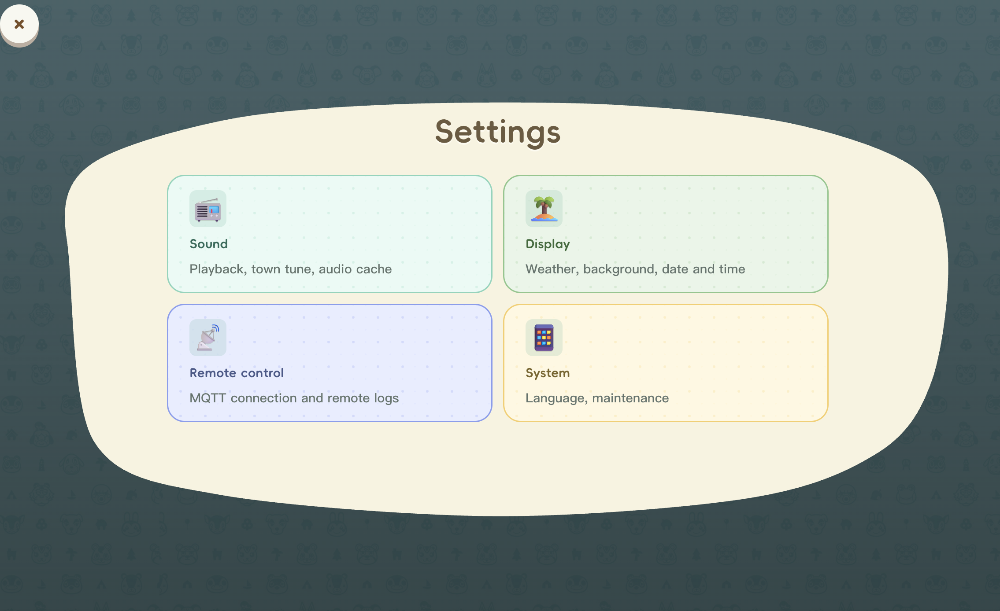

# 🏝 Animal-Island-UI

<div align="center">
        
</div>
<div align="center">
A React UI component library inspired by Animal Crossing: New Horizons
</div>
<br/>
<div align="center">
    <a href="https://github.com/guokaigdg/animal-island-ui/stargazers"></a>
    <a href="LICENSE"></a>
    <a href="LICENSE"></a>
    <a href="https://github.com/guokaigdg/animal-island-ui/releases"></a>
    <a href="https://gitcode.com/guokaigdg/animal-island-ui"></a>
    <br/>
    <a href="./coverage/badges/coverage.json"></a>
    
    
    
</div>
<br/>
<div align="center">
    <a href="https://hellogithub.com/repository/guokaigdg/animal-island-ui" target="_blank"></a>
</div>

<br/>
<p align="center">
    English | <a href="./docs/README.zh-CN.md">简体中文</a>
</p>


## Introduction

This project is a lightweight UI component library built with React + TypeScript. The design style is inspired by Nintendo's "Animal Crossing: New Horizons" game interface, created for personal front-end technical practice and component development learning.

All visual elements, layouts, icons, and animations are independently designed and implemented, without directly using any official Nintendo art materials, code, or resource files.

## 🎉 Vue Version

- [animal-island-vue](https://github.com/guokaigdg/animal-island-vue)

## Preview

- Online Preview (PC) [animal-island-ui-pc](https://guokaigdg.github.io/animal-island-ui/#/)
- Online Preview (Mobile) [animal-island-ui-mobile](https://guokaigdg.github.io/animal-island-ui/#/)

## 🚀 Use AI to Generate animal-island-ui Pages (No Coding Needed)

Non-developer and don't want to write code yourself? Use [`PROMPT.md`](./PROMPT.md) — no npm, no build step.

**4 steps:**

1. Copy [`PROMPT.md`](./PROMPT.md) in full.
2. Paste into any AI tool (Cursor / Claude / ChatGPT / Gemini / DeepSeek) and send.
3. The AI asks what page you want — reply in one phrase (e.g. "personal blog", "product list", "FAQ").
4. Save the `index.html` it returns and double-click to preview.

## Installation

```bash
npm install animal-island-ui
```


## Quick Start

> ⚠️ **Important**: Please make sure to import the styles with `import 'animal-island-ui/style'`, otherwise the components will have no styles or fonts!

```tsx
import { Button, Card } from 'animal-island-ui';
import 'animal-island-ui/style';

function App() {
    return (
        <div>
            <Button type="primary">Start Adventure</Button>
            <Card color="app-blue">
                Welcome to the deserted island!
            </Card>
        </div>
    );
}
```

## Documentation

Complete reference for different scenarios:

| Document | Purpose |
|---|---|
| [`PROMPT.md`](./PROMPT.md) | 🚀 One-click prompt for non-developers — paste into Cursor / Claude / ChatGPT / v0 / Bolt / Lovable / Windsurf to generate animal-island-ui-styled React pages. |
| [`AI_USAGE.md`](./AI_USAGE.md) | AI code assistant handbook - all component props, types and defaults word-for-word, 19 hard rules and copy-paste boilerplate, no invented APIs. |
| [`DESIGN_PROMPT.md`](./DESIGN_PROMPT.md) | Visual-style prompts for v0 / Figma AI / Midjourney / DALL-E, including color palette, fonts, size tables, Modal clip-path and prohibition list. |
| [`skill/SKILL.md`](./skill/SKILL.md) | Pixel-perfect style specification Skill - design tokens, all component CSS, Demo layout values, CSS variable templates and new component development checklist. |
| [`CONTRIBUTING.md`](./CONTRIBUTING.md) | Contributing Guide |


## Local Development

```bash
# Clone the repository
git clone https://github.com/guokaigdg/animal-island-ui.git
cd animal-island-ui

# Install dependencies
npm install

# Start Demo development server
npm run dev

# Build component library
npm run build

# Build Demo site
npm run build:demo
```


## Usage Cases

<table>
<tr valign="top">
  <td align="center" width="33%">
    <br/>
    
    <br/><a href="https://ashleycry.github.io/AnimalIslandNewTab/">Animal Island New Tab</a><br/><sub>Animal Crossing style new tab page</sub>
  </td>
  <td align="center" width="33%">
    <br/>
    
    <br/><a href="https://github.com/yunxinz/ac-site-template">ac-site-template</a><br/><sub>Animal Crossing themed personal website template</sub>
  </td>
  <td align="center" width="33%">
    <br/>
    
    <br/><a href="https://github.com/xiaochong/hi-kid">HiKid</a><br/><sub>English learning app for children</sub>
  </td>
</tr>
<tr valign="top">
  <td align="center" width="33%">
    <br/>
    
    <br/><a href="https://github.com/liuyuhong0324/AnimalIslandUI">AnimalIslandUI</a><br/><sub>Animal Crossing style Android UI library</sub>
  </td>
  <td align="center" width="33%">
    <br/>
    
    <br/><a href="https://itbug.shop/">ItbugShop</a><br/><sub>Liang Diandian's Blog</sub>
  </td>
  <td align="center" width="33%">
    <br/>
    
    <br/><a href="https://github.com/bk4ice/KidsMathQuest">KidsMathQuest</a><br/><sub>Math practice for elementary school</sub>
  </td>
</tr>
<tr valign="top">
  <td align="center" width="33%">
    <br/>
    
    <br/><a href="https://github.com/ohmangocat/animal_island_flutter">animal_island_flutter</a><br/><sub>Animal Crossing style Flutter UI library</sub>
  </td>
  <td align="center" width="33%">
    <br/>
    
    <br/><a href="https://github.com/guokaigdg/animal-island-blog">animal-island-blog</a><br/><sub>Animal Crossing style blog</sub>
  </td>
  <td align="center" width="33%">
    <br/>
    
    <br/><a href="https://github.com/TIUCSIB/animal-island-blog">Island Life Journal</a><br/><sub>Island Life Photo Journal</sub>
  </td>
</tr>
<tr>
  <td align="center" width="33%">
    <br/>
    
    <br/><a href="https://github.com/skyboooox/Animal-Crossing-Player">Animal Crossing BGM Player</a><br/><sub>ambience clock + hourly music</sub>
  </td>
</tr>
</table>


## Notes

- This project is for personal learning, research, and non-commercial demonstration only. Any form of commercial use, resale, or profit-making activities is prohibited.
- Not for use in any commercial products, enterprise projects, external services, or paid templates.
- Users are solely responsible for any risks arising from the use of this component library.

## Copyright and Disclaimer

- This project is not an official Nintendo product and has no association, authorization, or cooperation with Nintendo Co., Ltd.
- The game name included in the project name is only a descriptive reference to the style and does not constitute trademark use or brand association.
- All interface styles are merely design inspiration references and do not constitute reproduction or infringement of the original work.
- If the copyright holder believes that related content is suspected of infringement, they can contact via email, and I will make rectifications or deletions immediately.

## Contact

For any questions or copyright-related communications, please contact via Issue or email.

## License

MIT
This project is released under the MIT open-source license, for learning use only. The author is not responsible for any legal issues or losses caused by the use of this library.
